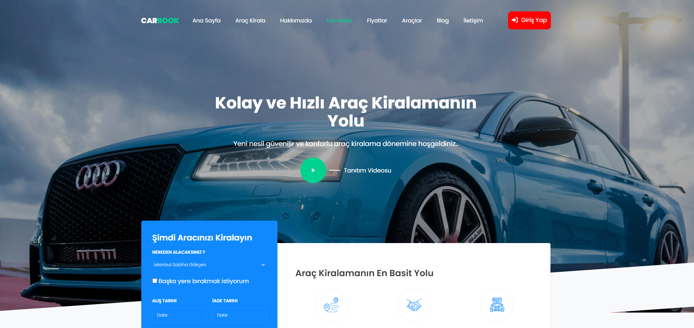
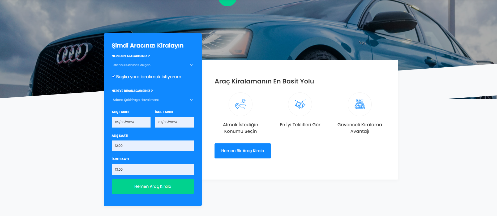
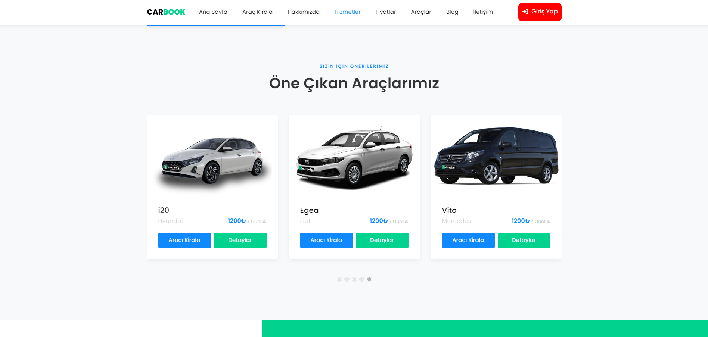
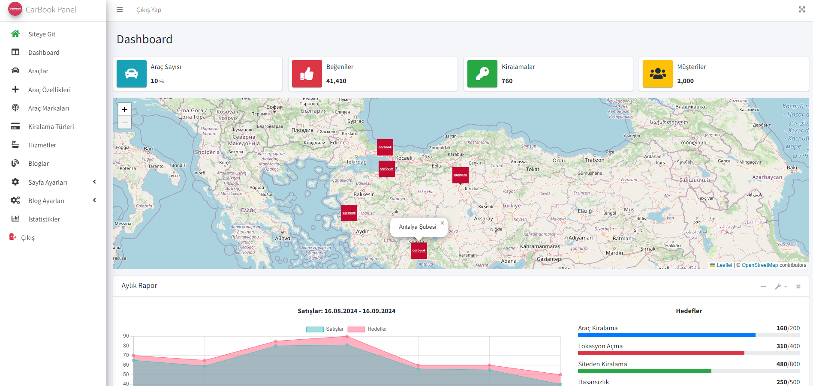
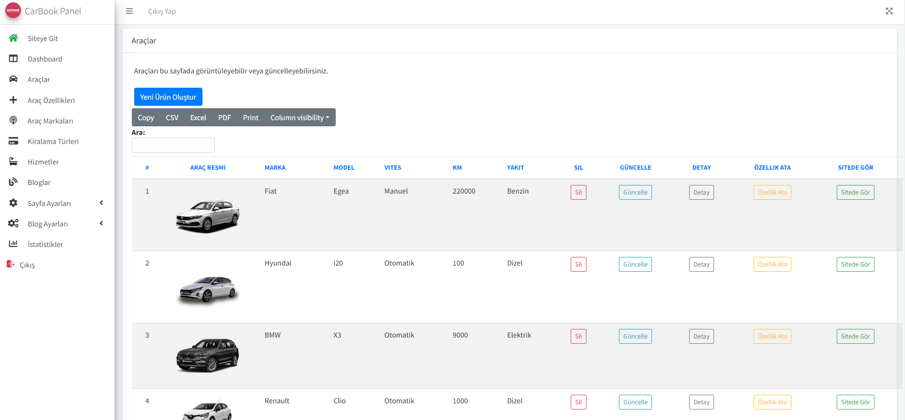
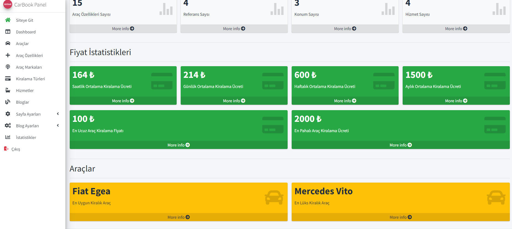
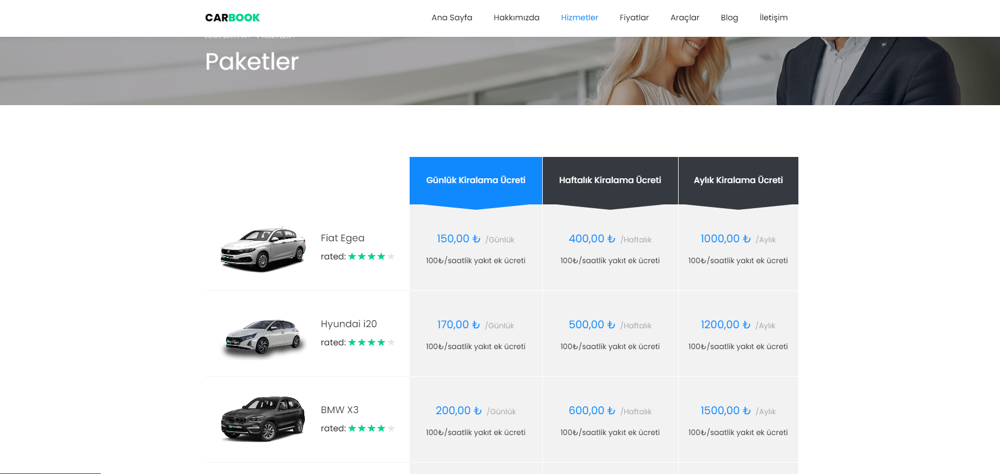

# BookCar Projesi

## Proje Açıklaması

**BookCar** projesi, bir araç kiralama sistemini geliştirmek için ASP.NET Core API ve Onion Architecture kullanarak tasarlandı. Bu proje, çeşitli tasarım desenlerini ve teknolojileri içermektedir:

- **CQRS** (Command Query Responsibility Segregation)
- **Mediator**
- **Repository Pattern**
- **Json Web Token (JWT)**: Kimlik doğrulama ve yetkilendirme işlemlerinde güvenlik sağlamak için.
- **SignalR**: Gerçek zamanlı iletişim için.
- **FluentValidation**: Veri doğrulaması sağlamak için.
- **Leaflet.js**: Harita gösterimi için.
- **DataTables**: Çok fonksiyonlu veri görüntüleme ve yönetimi için.

## Proje Özellikleri

- **Kullanıcı Yönetimi**: Kayıt, giriş, şifre sıfırlama ve kimlik doğrulama işlemleri.
- **Araç Kiralama**: Araçların listelenmesi, kiralanması ve yönetilmesi.
- **Harita Entegrasyonu**: Leaflet.js kullanarak araçların konumlarının harita üzerinde gösterilmesi.
- **Veri Yönetimi**: DataTables kullanarak araç ve kullanıcı verilerinin yönetimi ve görüntülenmesi.
- **Gerçek Zamanlı Bildirimler**: SignalR ile kullanıcılar arasında gerçek zamanlı bildirimler.

## Ekran Görüntüleri

